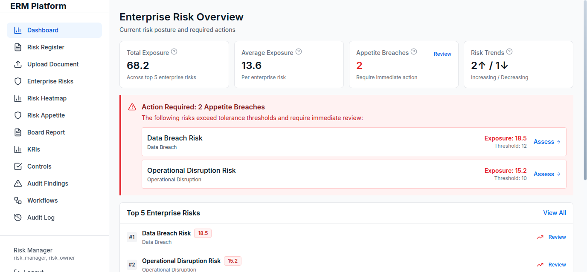

# GitHub Setup Guide

## 🚀 Preparing for GitHub Upload

### Step 1: Initialize Git Repository

```bash
cd /home/charry/erm
git init
```

### Step 2: Create .gitignore

✅ Already created: `.gitignore`

### Step 3: Add Files

```bash
# Add all files
git add .

# Check what will be committed
git status
```

### Step 4: Create Initial Commit

```bash
git commit -m "Initial commit: NIST 8286 ERM Platform with PDF Intelligence

Features:
- Core risk management (Register, Scoring, Enterprise Roll-Up)
- PDF Intelligence (Phase 1 & 2)
- NLP-based extraction (actors, deadlines, dependencies)
- Executive Dashboard
- Board Reporting
- Role-based access control
- Audit trail and evidence management"
```

### Step 5: Create GitHub Repository

1. Go to GitHub.com
2. Click "New repository"
3. Name: `erm-platform` (or your preferred name)
4. Description: "NIST IR 8286r1-aligned Enterprise Risk Management Platform with PDF Intelligence"
5. Visibility: Private (recommended for enterprise)
6. **Don't** initialize with README (we already have one)

### Step 6: Connect and Push

```bash
# Add remote (replace with your repo URL)
git remote add origin https://github.com/YOUR_USERNAME/erm-platform.git

# Push to GitHub
git branch -M main
git push -u origin main
```

---

## 📸 Screenshots Setup

### Before Pushing

1. **Take Screenshots** (see `docs/SCREENSHOTS.md`)
   - Landing Page
   - Login Page
   - Executive Dashboard
   - Risk Register
   - Risk Heatmap
   - Document Upload
   - Document Results
   - Review Queue
   - Board Report
   - Risk Appetite
   - Enterprise Risks
   - Risk Detail

2. **Save Screenshots**
   ```bash
   # Save screenshots to:
   docs/screenshots/landing-page.png
   docs/screenshots/login.png
   # ... etc
   ```

3. **Update README.md**
   - Add screenshot references
   - Update feature descriptions
   - Add visual examples

---

## 🔒 Security Checklist

Before pushing to GitHub:

- [ ] `.env` files in `.gitignore` ✅
- [ ] Database files in `.gitignore` ✅
- [ ] No secrets in code
- [ ] No API keys hardcoded
- [ ] No real user data
- [ ] JWT_SECRET not in repo

---

## 📝 Recommended Repository Settings

### GitHub Repository Settings

1. **Description:**
   ```
   NIST IR 8286r1-aligned Enterprise Risk Management Platform with PDF Intelligence. 
   Transform cybersecurity risks into board-ready enterprise risk intelligence.
   ```

2. **Topics (Tags):**
   - `risk-management`
   - `nist-8286`
   - `enterprise-risk`
   - `pdf-intelligence`
   - `compliance`
   - `typescript`
   - `react`
   - `express`

3. **Website:** (if deployed)
   - Add deployment URL

4. **License:** 
   - Private/Enterprise (no public license)

---

## 🎯 README Enhancements

### Add to README.md:

1. **Badges** (optional):
   ```markdown
   
   
   
   ```

2. **Screenshot Gallery:**
   ```markdown
   ## 📸 Screenshots
   
   <table>
     <tr>
       <td></td>
       <td></td>
     </tr>
     <tr>
       <td></td>
       <td></td>
     </tr>
   </table>
   ```

3. **Demo Video** (if available):
   ```markdown
   ## 🎥 Demo Video
   
   [Watch the demo](https://youtube.com/your-video)
   ```

---

## 📦 What to Include

### ✅ Include:
- Source code (`frontend/src/`, `backend/src/`)
- Configuration files (`package.json`, `tsconfig.json`, etc.)
- Documentation (`README.md`, `docs/`)
- Screenshots (`docs/screenshots/`)
- `.gitignore`

### ❌ Don't Include:
- `node_modules/`
- `dist/` or `build/`
- `.env` files
- Database files (`*.db`, `*.sqlite`)
- `uploads/` directory
- Log files

---

## 🔄 After First Push

### Create Development Branch

```bash
git checkout -b develop
git push -u origin develop
```

### Create Feature Branches

```bash
git checkout -b feature/pdf-intelligence-phase3
# ... make changes ...
git commit -m "Add workflow conversion for obligations"
git push -u origin feature/pdf-intelligence-phase3
```

---

## 📋 Pre-Push Checklist

- [ ] All code committed
- [ ] `.gitignore` configured
- [ ] No secrets in code
- [ ] README.md updated
- [ ] Screenshots taken and added
- [ ] Documentation complete
- [ ] Test credentials documented
- [ ] License specified

---

## 🚀 Quick Commands

```bash
# Initialize and push
git init
git add .
git commit -m "Initial commit"
git remote add origin https://github.com/YOUR_USERNAME/erm-platform.git
git branch -M main
git push -u origin main

# Update README with screenshots later
git add docs/screenshots/
git commit -m "Add screenshots"
git push
```

---

**Ready to share your world-class ERM platform!** 🎉

